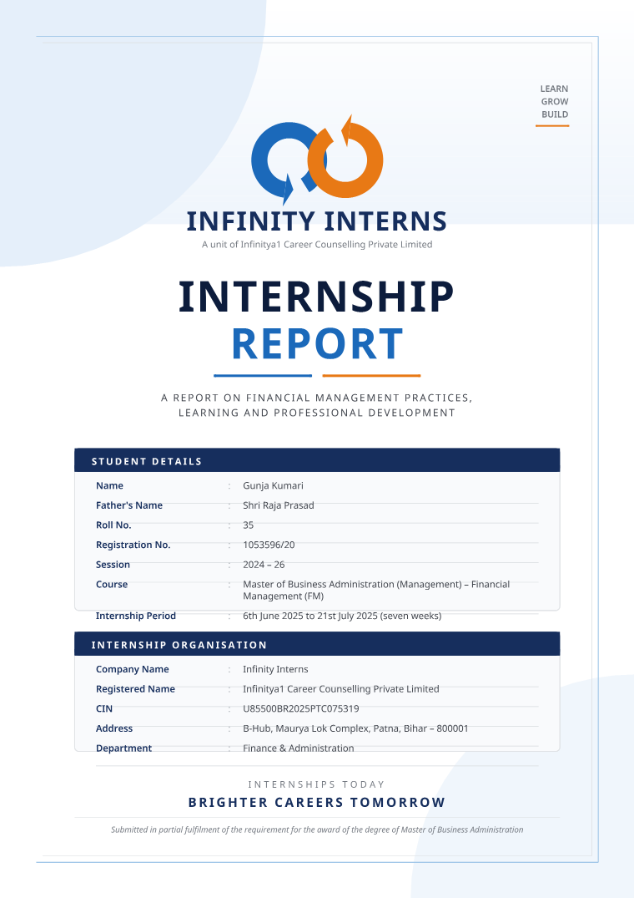
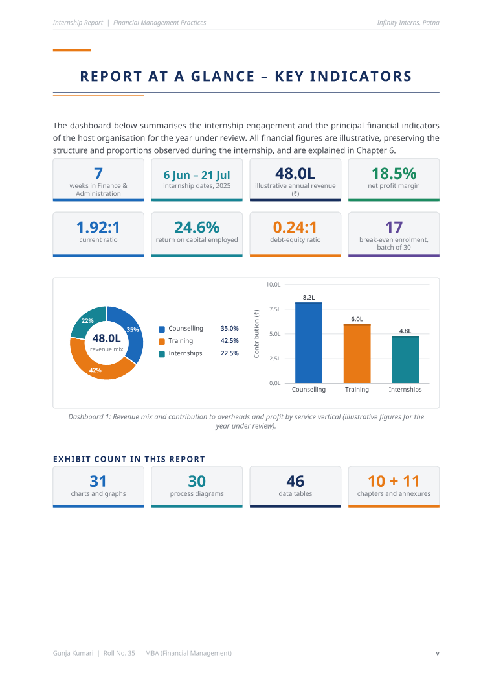
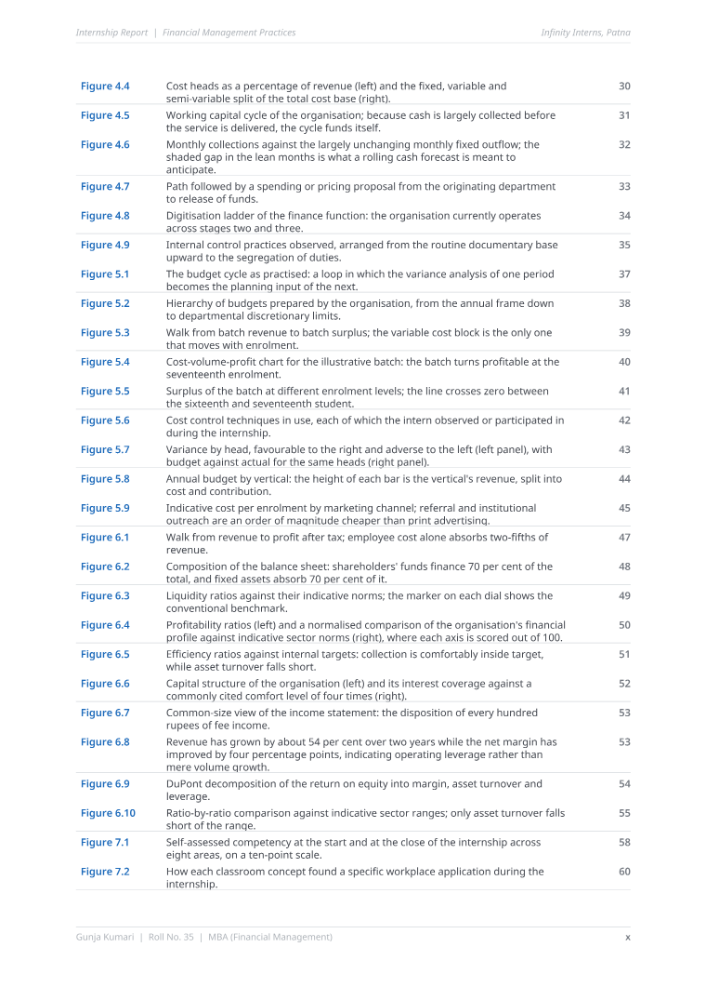
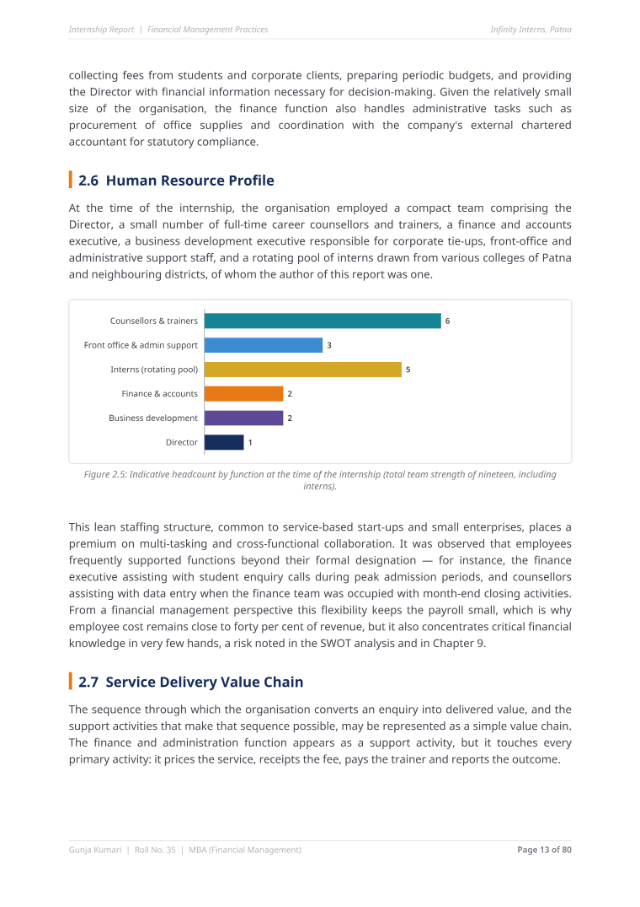
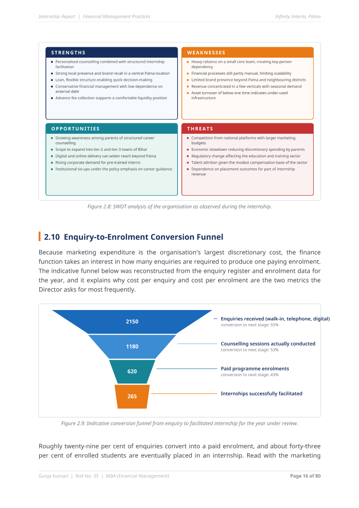
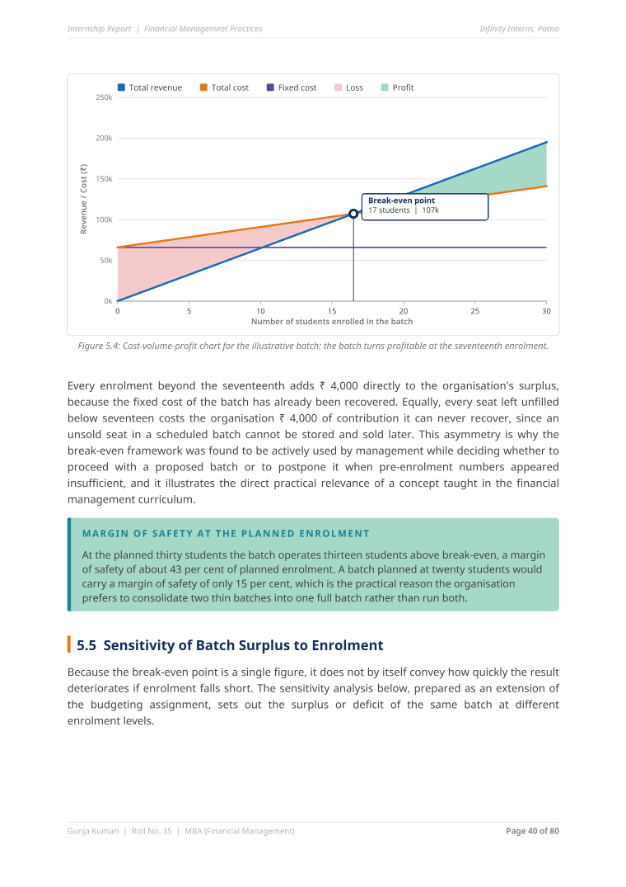
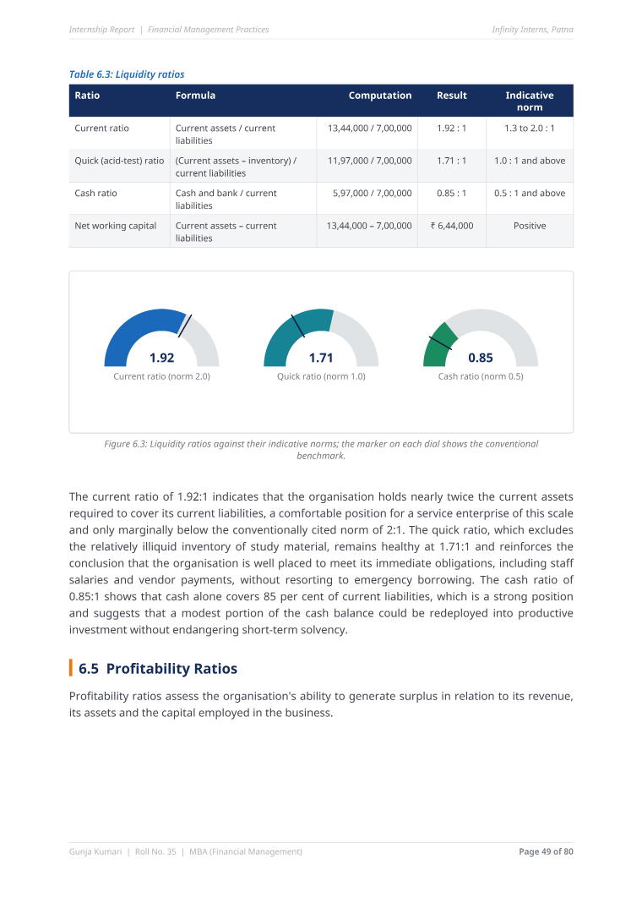
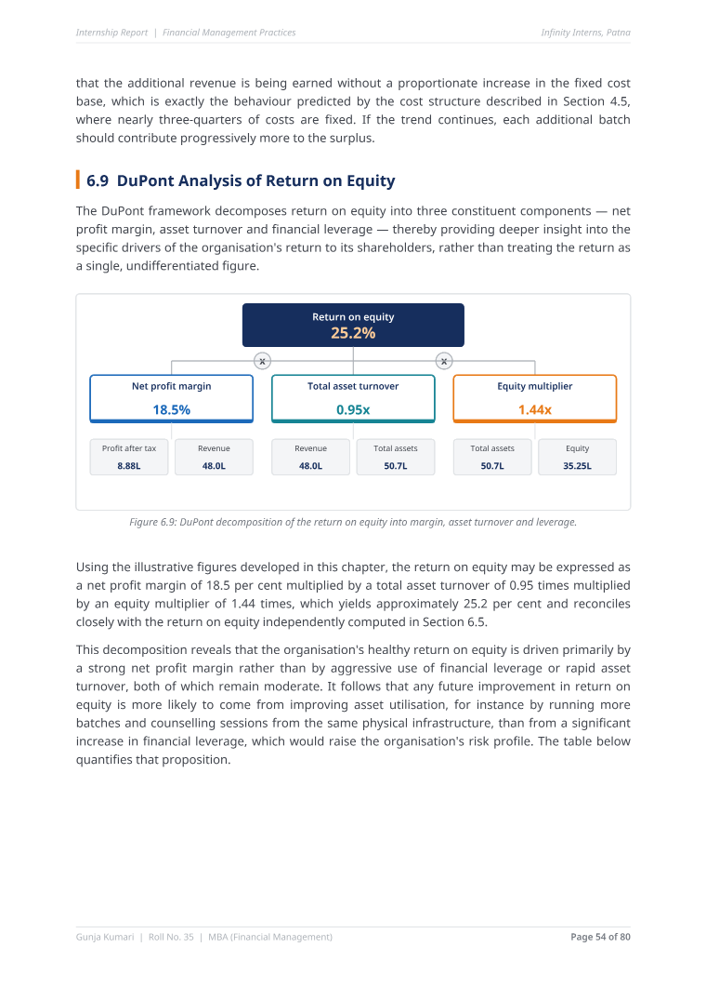
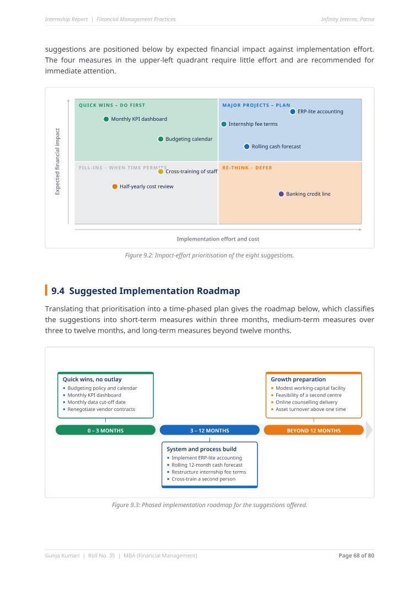

# MBA Summer Internship Report — Financial Management Practices at Infinity Interns

An illustrated, print-ready internship report submitted in partial fulfilment of the
MBA (Financial Management) degree requirement.

| | |
|---|---|
| **Submitted by** | Gunja Kumari — Roll No. 35, Reg. No. 1053596/20 |
| **Course** | MBA (Management) — Financial Management, Session 2024–26 |
| **Organisation** | Infinity Interns (Infinitya1 Career Counselling Private Limited), B-Hub, Maurya Lok Complex, Patna |
| **Department** | Finance & Administration |
| **Internship period** | 6th June 2025 to 21st July 2025 (seven weeks) |
| **Document** | [`Internship_Report_Gunja_Kumari_Illustrated.pdf`](./Internship_Report_Gunja_Kumari_Illustrated.pdf) — 94 pages, 2.2 MB |

## What the document contains

94 physical pages: a designed cover, 13 preliminary pages numbered i–xiii, and
**80 numbered body pages**, holding **61 figures (31 charts + 30 diagrams)** and
**46 tables**, plus a table of contents, a list of figures and a list of tables
that all carry real page numbers, and 20 PDF bookmarks.

| Chapter | Charts | Diagrams | Tables |
|---|---:|---:|---:|
| Preliminary pages (key-indicator dashboard) | 1 | 0 | 0 |
| 1 Introduction | 1 | 5 | 2 |
| 2 Company profile | 4 | 6 | 4 |
| 3 Internship tasks | 4 | 3 | 2 |
| 4 Financial management analysis | 3 | 6 | 7 |
| 5 Budgeting and cost control | 6 | 3 | 5 |
| 6 Ratio and financial analysis | 9 | 1 | 9 |
| 7 Learning outcomes | 1 | 1 | 2 |
| 8 Challenges faced | 0 | 2 | 2 |
| 9 Findings and suggestions | 1 | 3 | 3 |
| 10 Conclusion | 1 | 0 | 1 |
| Annexures A–K | 0 | 0 | 9 |
| **Total** | **31** | **30** | **46** |

Principal analytical exhibits include a cost-volume-profit break-even chart for a
training batch, a batch-budget waterfall with enrolment sensitivity, a monthly
budget variance analysis, a revenue-to-profit walk, liquidity dials against sector
norms, a DuPont decomposition of return on equity, a benchmark scorecard, a
seasonality chart of collections against fixed outflow, a fund-flow diagram, an
organisation chart, a SWOT matrix, a conversion funnel, a cause-and-effect
(fishbone) analysis and a phased implementation roadmap.

## Preview

| Cover | Key indicators | List of figures |
|---|---|---|
|  |  |  |

| Revenue mix and contribution | SWOT and conversion funnel | Break-even analysis |
|---|---|---|
|  |  |  |

| Liquidity ratio dials | DuPont driver tree | Priority matrix and roadmap |
|---|---|---|
|  |  |  |

## Rebuilding the PDF from source

The PDF is generated by the Python sources in [`src/`](./src). No third-party
packages are required — PDF writing, TrueType font embedding, every chart and
every diagram are implemented from scratch, so the only prerequisites are Python 3
and the Noto Sans fonts (`/usr/share/fonts/google-noto`).

```bash
cd src
python3 build.py ../Internship_Report_Gunja_Kumari_Illustrated.pdf   # three-pass build
python3 validate.py ../Internship_Report_Gunja_Kumari_Illustrated.pdf  # structural check
python3 renderall.py 1 94                                            # optional PNG previews
```

The build runs three times so that the table of contents, list of figures and list
of tables print the page numbers collected on the previous pass; pagination is
stable from the second pass onwards. See [`src/README.md`](./src/README.md) for a
description of each module and for guidance on editing the content.

## Note on the figures used

Where the organisation's actual figures are confidential, the report uses
illustrative amounts that preserve the structure and proportions observed during
the internship — revenue of ₹48,00,000, a net profit margin of 18.5 per cent, a
current ratio of 1.92:1, a debt-equity ratio of 0.24:1 and a batch break-even at
17 of 30 seats. Every number is labelled *observed*, *illustrative* or
*indicative* at the place it appears, and the qualification is stated in the
student declaration and again in Section 6.1.
